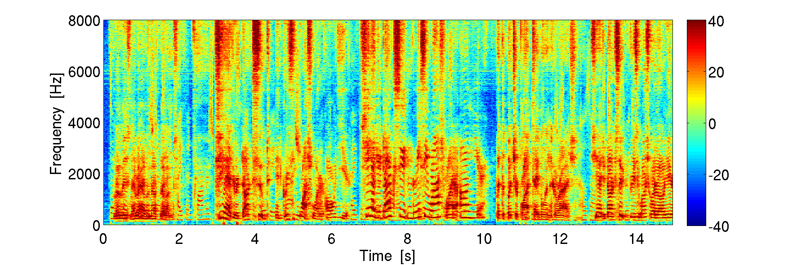
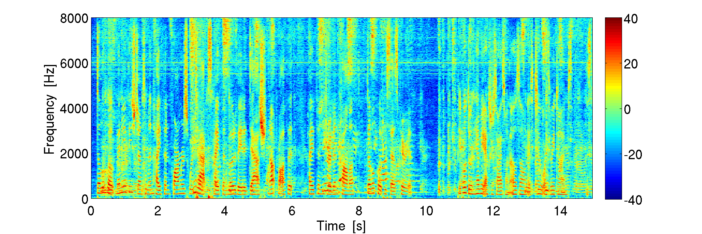
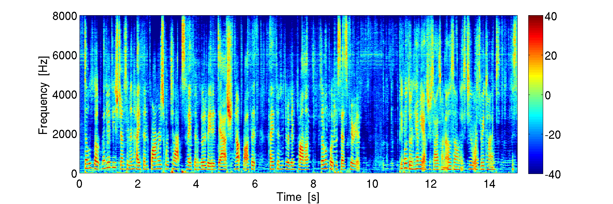
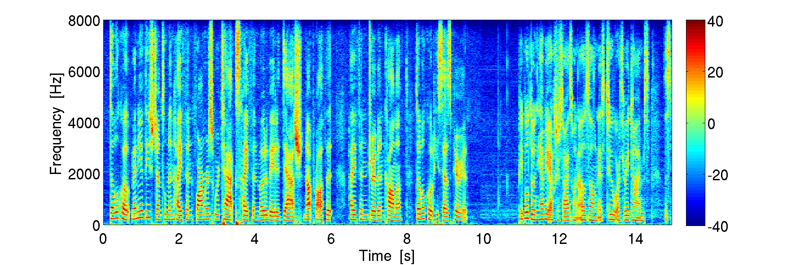

# NRES
Neural Residual Echo Suppressor
=========================


This repository contains python/tensorflow code to reproduce the experiments presented in our paper
[Nonlinear Residual Echo Suppression Using a Recurrent Neural Network](https://www.isca-speech.org/archive/Interspeech_2020/pdfs/1473.pdf).


Requirements
------------

The data loader uses the 'soundfile' package to read/write wavs:
```
pip install soundfile
```


Preriquisites
-------------

Prior to training, you need to set up your data base containing echo recordings.
In particular, you need a recording from the microphone signal (d), and a recording of the echo model (y) from the AEC.
These recordings must not contain double-talk.
Also, you need to reference a database to generate double-talk (i.e. WSJ0) in `./loaders/feature_generator.py` 
For further details, see our paper.


Training
--------

To train the NRES model, use:
```
cd experiments
python3 nres.py train
```


Training
--------
To test the NRES model, use:
```
cd experiments
python3 nres.py test
```

This will write predictions to: `./predictions/` 


Performance
-----------

Microphone input with double-talk (d)


AEC residual (e)


Enhanced output (z)


Near-end signal (s)



Citation
--------

Please cite our work as 

```
@inproceedings{pfeifenberger2020residual,
  author={Lukas Pfeifenberger and Franz Pernkopf},
  title={{Nonlinear Residual Echo Suppression Using a Recurrent Neural Network}},
  year={2020},
  booktitle={Proc. Interspeech 2020},
  pages={3950--3954},
  doi={10.21437/Interspeech.2020-1473},
}

```


